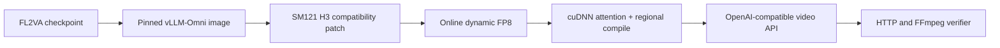

# MiniMax H3 on one NVIDIA DGX Spark

[](LICENSE)
[](https://www.nvidia.com/en-us/products/workstations/dgx-spark/)
[](#verified-configuration)
[](#verified-configuration)

A measured compatibility recipe for serving MiniMax H3 FL2VA on a single
NVIDIA DGX Spark with vLLM-Omni and online FP8.

I built this after the obvious single-Spark paths failed in different ways:
BF16 ran out of practical unified-memory headroom, INT8 reached an unsupported
SM121 kernel, and the first online-FP8 attempt exposed several day-zero loader
and activation bugs. This repository keeps the successful path small,
inspectable, and repeatable.

> [!IMPORTANT]
> MiniMax H3 is **not** licensed under this repository's Apache-2.0 license.
> Its Community License currently excludes the United States, European Union,
> United Kingdom, and Republic of Korea, and also restricts use and display of
> outputs outside its applicable territory. Read [MODEL-LICENSE.md](MODEL-LICENSE.md)
> and obtain any authorization you need from MiniMax before downloading,
> running, or displaying model output. This repository contains no model
> weights and no generated media.

## Verified configuration

| Item | Measured result |
|---|---:|
| Hardware | 1x DGX Spark, GB10, ARM64, SM121, 128 GB-class unified memory |
| Runtime | Pinned `vllm/vllm-omni:minimax-h3` ARM64 image |
| Checkpoint | MiniMax H3 FL2VA, approximately 135 GiB on disk |
| Quantization | Online dynamic FP8; six sensitive projections kept unquantized |
| Full-compute default | cuDNN attention + regional compile, no cache |
| Optional balanced profile | cuDNN + regional compile + Cache-DiT at `0.10` |
| Model load | 89.1659 GiB; 519–543 seconds across cold starts |
| Baseline warmed request | 152.911 seconds client mean (sweep, two runs) |
| Full-compute warmed request | 111.373 seconds client mean (final image, two runs) |
| Balanced warmed request | 80.579 seconds client mean (final image, two runs) |
| Matched quality comparison | SSIM 0.881367; video PSNR 26.613264 dB |
| Output shape observed | 768x448, 24 fps, H.264 + AAC stereo |
| Regression tests | 5 passed in the exact pinned image |

These are observations from one machine, not vendor benchmarks or an upstream
support guarantee. Each performance number above uses the same fixed request
and excludes the first compile/cache warm-up. Cache-DiT reuses approximate
intermediate state; it is not lossless. The generated media is deliberately not
published because of the model-license restrictions above.

## Compatibility layer



The patch makes four focused corrections:

1. Normalizes grouped checkpoint QKV rows before native parameter loading.
2. Preserves vLLM's native weight-loader signature for online FP8.
3. Binds FP8 activation quantizers to the supported native CUDA operation on
   SM121 instead of the failing compiled wrapper.
4. Keeps AdaLN activations in BF16 after its linear weights become FP8.

FlashAttention-4's CuTe variable-length kernel also failed for this packed H3
shape on SM121. The measured release supports SDPA and cuDNN attention; cuDNN
with regional compile is the full-compute default. See
[docs/PATCH.md](docs/PATCH.md) for the failure chain and why each change exists.

## Quick start

Prerequisites:

- NVIDIA DGX Spark or equivalent ARM64 GB10 system
- Docker with Compose and NVIDIA GPU support
- At least 110 GiB of memory available before launch
- A complete MiniMax H3 FL2VA checkpoint
- Authorization to use MiniMax H3 in your territory
- FFmpeg, including `ffmpeg` and `ffprobe` (required by smoke and verification)

```bash
git clone https://github.com/joeynyc/MiniMax-H3-DGX-Spark.git
cd MiniMax-H3-DGX-Spark
cp .env.example .env
# Edit .env: checkpoint path, HF cache path, and license acknowledgment.
# The secure default listens only on 127.0.0.1.

make preflight
make build
make up
make logs
```

Cold startup took about nine minutes on the measured machine. Wait until both
checks pass:

```bash
make status
```

Then, only where your model license permits generation and display:

```bash
make smoke
make verify
```

The default is the fastest validated full-compute profile. The optional
balanced profile was faster in this request, but it is approximate. Enable it
only after reading [docs/REPRODUCIBILITY.md](docs/REPRODUCIBILITY.md):

```dotenv
H3_DIFFUSION_ATTENTION_BACKEND=CUDNN_ATTN
H3_EXECUTION_MODE=compile
H3_CACHE_BACKEND=cache_dit
H3_CACHE_CONFIG='{"Fn_compute_blocks":1,"Bn_compute_blocks":0,"max_warmup_steps":4,"max_cached_steps":-1,"residual_diff_threshold":0.10,"max_continuous_cached_steps":1,"enable_taylorseer":false}'
```

The API base defaults to `http://127.0.0.1:8000/v1`; synchronous generation is
served at `POST /v1/videos/sync`. The smoke script stages the response, checks
the HTTP status, rejects JSON/error bodies, and only promotes a file after
`ffprobe` confirms a media container.

Remote access is deliberately opt-in. Read [SECURITY.md](SECURITY.md) before
changing `H3_BIND_HOST`; a non-loopback bind requires both
`H3_ALLOW_REMOTE_API=true` and a strong `H3_API_KEY`. The client scripts send
the configured bearer token automatically. Do not expose this service directly
to the public internet.

## Repository map

| Path | Purpose |
|---|---|
| `Dockerfile` | Builds on the exact verified base-image digest |
| `compose.yaml` | Portable single-GPU service without host-specific paths |
| `patches/` | Apache-2.0 H3 compatibility module with modification notice |
| `scripts/preflight.sh` | Architecture, memory, model, port, license, and network-safety checks |
| `scripts/security-common.sh` | Shared fail-closed loopback/remote-access policy |
| `scripts/smoke-t2va.sh` | Fail-closed T2VA acceptance request |
| `scripts/verify-output.sh` | Streams, full decode, audio, and checksum validation |
| `scripts/benchmark-profile.sh` | Cold start, warm requests, identity, OOM, memory, and swap capture |
| `scripts/compare-quality.sh` | Frame-aligned SSIM/PSNR, audio comparison, and inspection frames |
| `scripts/runtime-provenance.sh` | Exact image ID, architecture, and runtime-version check |
| `tests/` | Focused loader/FP8/AdaLN regression coverage |
| `docs/RESULTS.md` | Exact measured acceptance evidence |
| `docs/REPRODUCIBILITY.md` | Profiles, workload, warm-up, and quality-comparison method |
| `docs/TROUBLESHOOTING.md` | Symptom-to-cause guidance from the bring-up |

## Scope and honesty

- This is a single-Spark FL2VA path, not a multi-node H3 implementation.
- It uses online FP8; it is not the BF16 quality baseline.
- The pinned image warns that its bundled vLLM and vLLM-Omni versions are not
  aligned. The recorded path passed, but that warning is not suppressed.
- No model weights, Hugging Face credentials, private endpoints, or generated
  outputs belong in this repository.
- The launcher uses `--trust-remote-code`; use only a checkpoint from the
  authoritative model source and read the runtime boundary in `SECURITY.md`.
- Cache-DiT is approximate. Its measured same-seed SSIM/PSNR results are not a
  guarantee for a different prompt, seed, resolution, step count, or runtime.
- Re-run the full acceptance flow before changing the base-image digest,
  attention backend, execution mode, cache settings, or patch.

## Upstream and attribution

- [MiniMax H3 model card](https://huggingface.co/MiniMaxAI/MiniMax-H3)
- [MiniMax H3 Community License](https://huggingface.co/MiniMaxAI/MiniMax-H3/blob/main/LICENSE)
- [vLLM-Omni](https://github.com/vllm-project/vllm-omni)
- [Upstream H3 recipe](https://github.com/vllm-project/vllm-omni/blob/main/recipes/MiniMaxAI/MiniMax-H3.md)
- [H3 support pull request](https://github.com/vllm-project/vllm-omni/pull/5691)

Thanks to [@riverar](https://github.com/riverar) for catching the missing
FFmpeg prerequisite in [PR #2](https://github.com/joeynyc/MiniMax-H3-DGX-Spark/pull/2).

The repository code is Apache-2.0. MiniMax H3 weights and outputs remain subject
to MiniMax's separate license. See [NOTICE](NOTICE) for source attribution.
